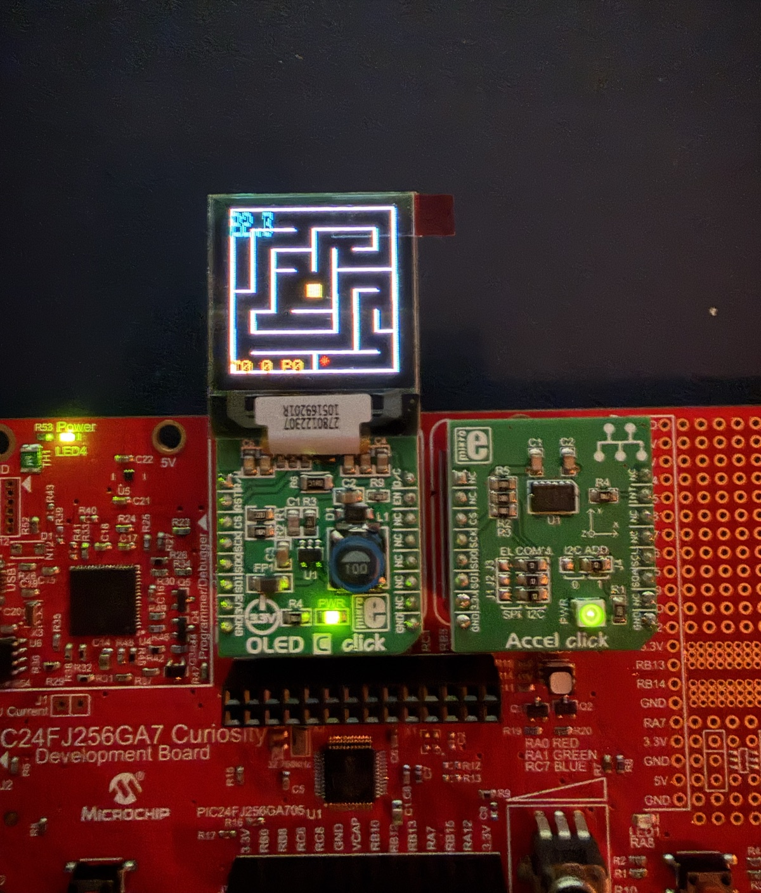
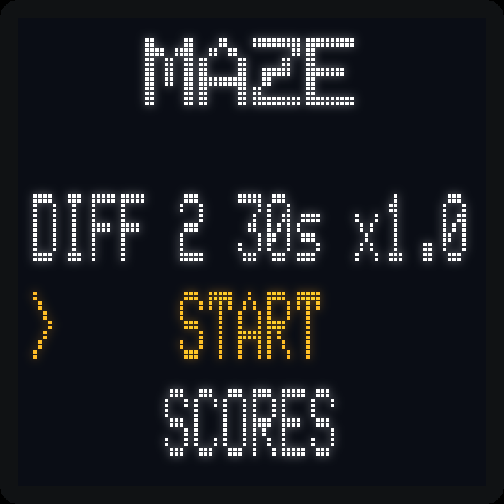
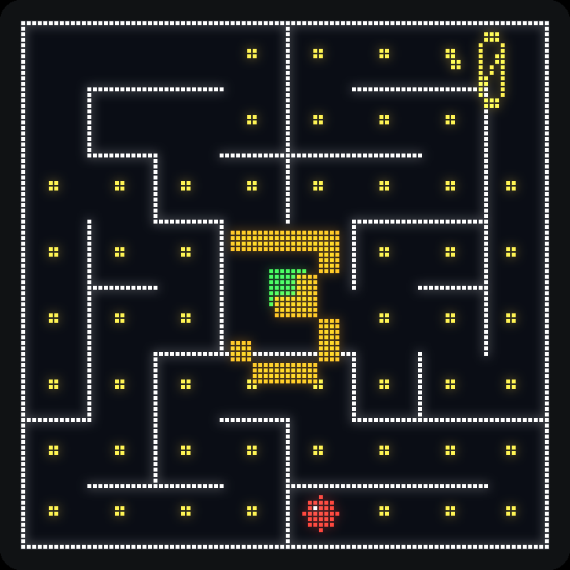
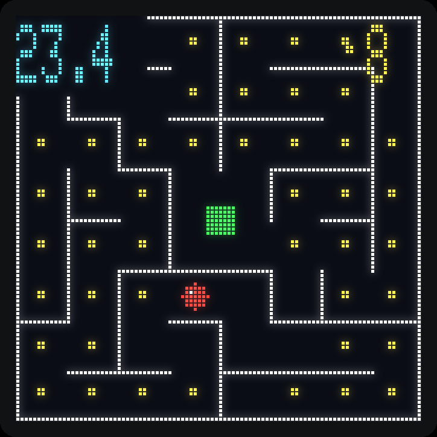
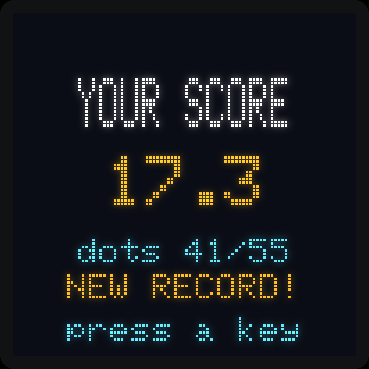
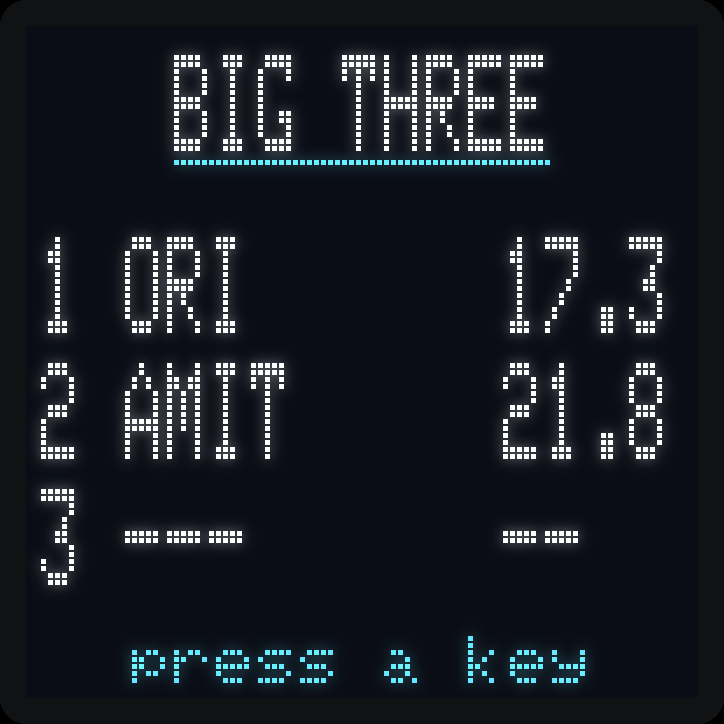
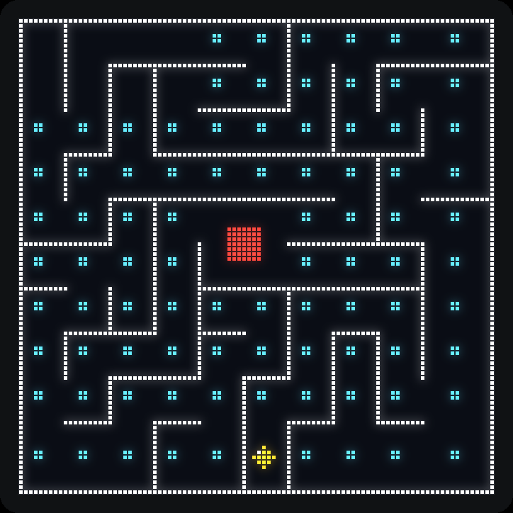

# Maze Ball Game - Final Project

A ball-in-maze game for the **PIC24FJ256GA705 Curiosity** board. Tilt the board
to roll a ball (read with the **ADXL345** accelerometer) from START to FINISH of
a 96x96 maze on the **OLED**, within a time limit set by the chosen difficulty.
Gold coins are scattered through the corridors to collect on the way (with a
live counter), a 3-2-1 countdown opens every round, and beating the best time
earns a NEW RECORD screen.

Built on the course **accelerometer-lab template** (System / oledDriver /
spiDriver / i2cDriver), as required, so it compiles unchanged with XC16.

  

---

## Build & run

* Open `Maze.X` in MPLAB X (device PIC24FJ256GA705, tool *Starter Kits (PKOB)*,
  compiler XC16 v2.10), then **Clean and Build** and **Make and Program Device**.
* Hardware: **OLED C Click** in socket A, **Accel Click** in socket B.
* Builds `-Wall` clean with XC16 v2.10 (about 22 KB program, 2.6 KB RAM).

## Controls

| Control | Action |
|---|---|
| Potentiometer | scroll menu / pick a letter in name entry |
| S1 | select / move name cursor **left** |
| S2 | select / move name cursor **right** |
| S1 + S2 (held briefly) | save name |
| S1 or S2 (in game) | pause / resume (the clock stops) |
| Hold S1 (2 s) | abort game, back to the main menu |

See `OPERATING_INSTRUCTIONS.txt` for full gameplay.

---

## Screens

Simulated frames, rendered pixel-exact from the game's own drawing code and
font:

| Menu | Countdown | Gameplay |
|---|---|---|
|  |  |  |

| Win | Score | Big Three |
|---|---|---|
|  |  |  |

---

## Source layout

| File | Responsibility |
|---|---|
| `main.c` | entry: `SYSTEM_Initialize`, `game_init`, `game_run` |
| `game.c/.h` | state machine: menu, gameplay, win/lose, score, name entry, blink |
| `game_config.h` | all tunable constants (timing, physics, colors, maze size) |
| `maze.c/.h` | maze generation, wall rendering, pixel-collision bitmap |
| `ball.c/.h` | ball physics (tilt to velocity), per-axis wall collision, draw/erase |
| `accel.c/.h` | ADXL345 tilt vector (X/Y) via a single I2C burst read |
| `input.c/.h` | potentiometer (ADC) + S1/S2 buttons (debounce, long-press) |
| `ticktimer.c/.h` | Timer1 10 ms tick, millisecond time base |
| `scoreboard.c/.h` | "Big Three" high-score table (lower time = better) |
| *template* | `System/`, `oledDriver/`, `spiDriver/`, `i2cDriver/`, `Accel_i2c.*` |

## Hardware pin map (PIC24FJ256GA705 Curiosity)

| Function | Pin(s) |
|---|---|
| OLED (SPI1) | SDI=RB13, SDO=RB14, SCK=RB15; CS=RC9, DC=RC3, RST=RA13, EN=RC8 |
| Accelerometer | I2C1 (ADXL345, write addr `0x3A`, DEVID `0xE5`) |
| Potentiometer | pin RB12 = ADC channel AN8 |
| Button S1 | RA11 (active-low, pull-up) |
| Button S2 | RA12 (active-low, pull-up) |

---

## How the spec maps to the code

* **Difficulty 1-3** (time + speed factor): `DIFFS[]` in `game.c`, constants in
  `game_config.h`. The speed factor is an integer percent (80/100/120) to avoid
  floating point.
* **Timer** in tenths of a second, top-left, real-time: `draw_timer()`; time
  base from the Timer1 tick (`ticktimer.c`).
* **Tilt to motion**, per-axis, speed scaled by difficulty: `ball_update()`
  (fixed-point: a 1/16-pixel accumulator lets gentle tilts creep smoothly).
* **Walls block the ball; ball stays in the window**: `maze_ball_collides()`
  tests the ball disc against a rasterized 96x96 wall bitmap; the outer border
  is always walled. Motion steps one pixel at a time so thin walls cannot be
  tunneled through.
* **Ball = filled circle, erase-then-draw**: `ball_render()` repaints the old
  position in the background color, then draws the new one.
* **Walls = 1-px lines**: rendered from the logical wall model as 1-pixel
  strips.
* **Last 5 s blink** (normal/inverse, 2 swaps per second): `display_inverse` /
  `display_normal` in the play loop.
* **Long-press S1 (2 s) aborts to menu**: `input_s1_long_press()`.
* **Win/Lose screens, score, name entry, Big Three**: `run_result()`,
  `run_name_entry()`, `scoreboard.c`.

Beyond the brief: fresh maze every game (the brief suggests one fixed maze),
per-difficulty maze density and ball size, collectible corridor coins with a
live counter (score stays the game time, as specified - the end screens just
report the coin count), a 3-2-1 countdown, a win animation, and NEW RECORD
detection.

## Maze generation

Each game carves a fresh maze with an iterative recursive-backtracker over a
logical grid (8x8, 10x10 or 12x12 cells depending on difficulty; the seed
changes every game). Because a single backtracker run can produce a short
solution route, generation tries several seed variants and keeps the maze with
the longest START-to-FINISH route that still has at least 5 dead ends, per the
project brief. The ball starts at the bottom-center cell; FINISH is a 2x2
room in the center, filled green.

## Tuning

Everything playable is in `game_config.h`: ball feel via `TILT_VEL_DEN`
(higher = calmer), `TILT_DEADZONE` and `BALL_MAX_STEP`; tilt-to-screen axis
mapping via `ACCEL_X_SIGN` / `ACCEL_Y_SIGN`.

## AI-assisted engineering workflow

Beyond the firmware itself, this project was an exercise in using AI agents
as engineering tools. I built the workflow around
[Claude Code](https://claude.com/claude-code) and split the work across
multiple agents, each with a job where an agent actually beats a human at the
keyboard:

* **Hardware debugging agent.** Drove the board's PKOB debugger headlessly
  (MPLAB's `mdb` scripted from the CLI): breakpoint sessions that dumped
  `I2C1STAT` at each phase of an I2C transaction. That traced a real timing
  bug in the course template driver: its TRSTAT polling let queued bytes be
  silently dropped (IWCOL), so register writes never reached the ADXL345 and
  it never entered measure mode. When the debugger's own halts masked the
  race, the agent switched tactics and captured full-speed `I2C1STAT` traces
  into RAM instead, then read them out after the fact.
* **Host-side test harness.** The game logic (`maze.c`, `ball.c`,
  `scoreboard.c`) was compiled natively against the *real* OLED driver code
  with only the hardware boundary mocked, and fuzzed: every generated maze
  proven solvable by the actual ball footprint, pixel by pixel. Compiling the
  real driver instead of an idealized mock is what exposed a template bug
  where vertical walls were never drawn.
* **Adversarial review agents.** Two independent agents on different models
  reviewed the final code and docs cold, hunting comment-vs-code mismatches
  and layout math errors. They caught real bugs: hint strings that clipped at
  the 96 px panel edge, a stale button edge that leaked from name entry into
  the menu, and a cursor underline one pixel short.
* **Closed-loop hardware verification.** Photos of the OLED went back into
  the loop after each flash, so every fix was confirmed on the actual panel,
  not just in theory.
* **Pixel-exact screen simulator.** A small Python tool renders every screen
  from the same drawing calls and the panel font, so UI changes could be
  reviewed as images (the frames above) before touching the hardware.
